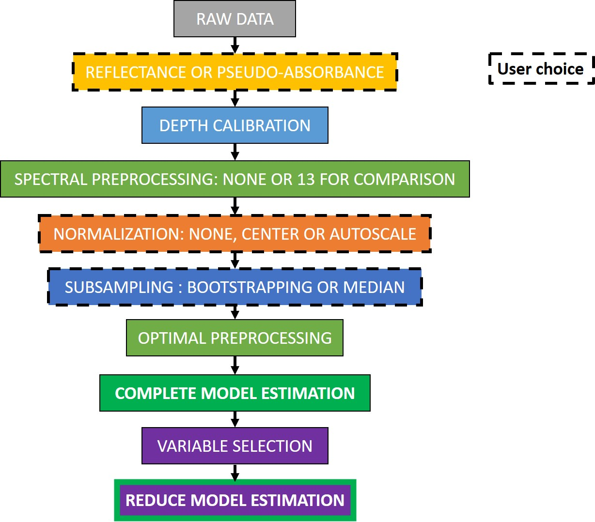
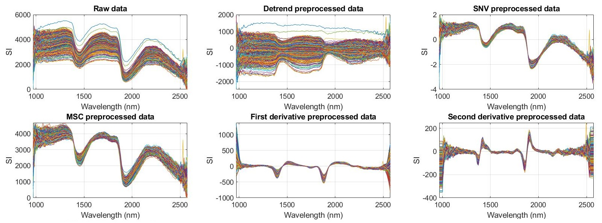

# Matlab Toolbox for the creation of a PLSR model

Please cite :

Jacq, K., Perrette, Y., et al. (2019) High-resolution prediction of organic matter concentration with hyperspectral imaging on a sediment core. Science of the Total Environment 663: 236–244

or

Jacq, K., Giguet-Covex, C., et al. (2019) High-resolution grain size distribution of sediment core with hyperspectral imaging. Sedimentary Geology 393–394:

# Worflow

## Raw data

Two types of data are mandatory to use this toolbox. First, an hyperspectral image (M) and some information, depth (dm) and wavelength (wl). Secondly, the variable(s) to predict (Y), that can be a vector or a matrix, its sampling depth vector (dy) and the label (Yn).

## Reflectance or pseudo-absorbance
Generally, the hyperspectral image unity is reflectance (R). According to Beer-Lambert law, the chemical concentration of a compound is related to the absorbance (A). Thus, the hyperspectral image can be converted in pseudo-absorbance with the formula: A=log(1/R).

## Depth calibration
The two depth vectors are then compared to find the hyperspectral pixels related to a sampling area.

## Spectral preprocessing

## Normalization

## Subsampling

## Optimal preprocessing

## Complete model estimation

## Variable selection

## Reduce model estimation
